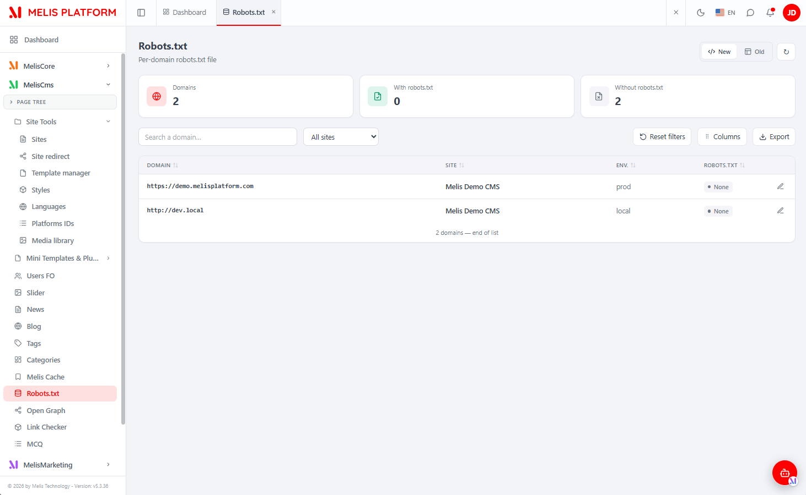
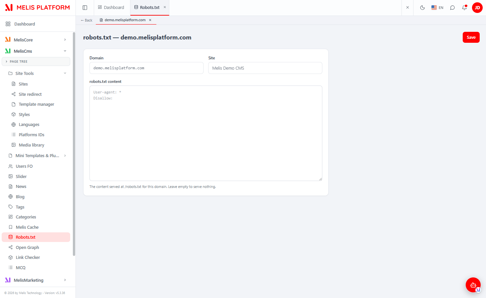

# MelisCmsSiteRobot (React back-office) — Functional & Technical Documentation (for AI)

> **What this is.** MelisCmsSiteRobot manages the **`robots.txt` of each site domain** from the
> back-office and serves it **dynamically** at `https://<domain>/robots.txt` (straight from the
> database, no static file). This document covers it **in the new React back-office**
> (`/melis-react`): the module ships a **native full-React brick** — a real React list + editor
> calling a `react-api` JSON layer — with a **New / Old toggle** that can fall back to the legacy
> tool in an iframe. For the underlying data model, the dynamic `/robots.txt` route and the
> engine table gateways, see the [legacy tool doc](./MelisCmsSiteRobot.md); this doc does not repeat
> them.
>
> **How this document is organised — two clearly separated parts:**
> - **[Part A — Functional Guide](#part-a--functional-guide)** — for everyday users (and the
>   chat assistant) using the React back-office. Plain language.
> - **[Part B — Technical Reference](#part-b--technical-reference)** — for developers and AI
>   building inside the React UI, with code (brick manifest, endpoints, capabilities).
>
> **Audience**: consumed by the **MelisAI** MCP. **Status**: reviewed 2026-08-19.

---

## 0. Where this lives in the React back-office — read this first

- **Brick kind: native full-React** (not an iframe brick). The UI is authored in React
  (`ui-react/src/`) and reads/writes through `/melis/react-api/site-robots…` endpoints defined in
  the module. It also keeps a **New / Old toggle**: *Old* renders the legacy tool in an iframe
  (`/melis/react-tool-page?key=site_robot_tool_display`), *New* is the React UI (default).
- **Where in the menu.** Sidebar → **MelisCms** group → **Robots.txt** (tree route
  `/melis-cms/site-robot`; the manifest `route` is already the full tree route). The tool appears
  **only if the module is activated** (modular brick discovery, see §B5).
- **Two levels**, surfaced as **native host sub-tabs**: **list of site domains → the robots.txt
  editor of one domain**. There is **no add / delete-domain** — domains come from the **Sites**
  tool; you only edit (or clear) each domain's robots.txt.
- **Coupled siblings.** The list is fed by the platform's **site domains** (from the Sites tool);
  the same `robot_text` is served on the front by the dynamic `/robots.txt` route — both live in the
  legacy tool doc. Cross-reference: [MelisCmsSiteRobot.md](./MelisCmsSiteRobot.md).

---
---

# PART A — Functional Guide

## A1. What you can do with MelisCmsSiteRobot in the new back-office

- **Edit a domain's `robots.txt`** — one row per site domain; open it and write the body served at
  that domain's `/robots.txt`.
- **See at a glance which domains have a robots.txt** — KPI cards (Domains / With robots.txt /
  Without robots.txt) and a per-row **Set / None** badge.
- **Clear a domain's robots.txt** — the delete action wipes the content (the **domain itself is not
  removed** — it comes from the Sites tool).
- **Search, filter by site, sort, manage columns and export** — a keyset-scrolled list with column
  manager and CSV/spreadsheet export.
- **Compare New vs Old** — switch the whole tool between the React UI and the classic tool with the
  **New / Old** toggle.

## A2. Finding it in /melis-react

**Where:** left sidebar → **MelisCms** → **Robots.txt**. It opens as a top tab named **Robots.txt**.


*The React Robots.txt tool: KPI cards (Domains / With robots.txt / Without robots.txt), a "Search a domain…" box, an "All sites" filter, Reset filters / Columns / Export, the New/Old toggle (top-right) and a refresh (↻). Each domain row shows Domain, Site, Env. and a "Set / None" robots.txt badge, with an edit (pencil) action; here two domains (`https://demo.melisplatform.com`, `http://dev.local`) both mapped to "Melis Demo CMS", both "None".*

## A3. Key words explained

- **Domain** — one site domain (e.g. `demo.melisplatform.com`). Domains are **read-only here**: they
  come from the **Sites** tool. Each has an **environment** (`prod`, `local`…) and a scheme.
- **robots.txt** — the small file crawlers read to know which parts of a site they may index. This
  tool edits it **per domain**; it's served live at `https://<domain>/robots.txt`.
- **Set / None** — the per-row badge: **Set** = this domain has a non-empty robots.txt, **None** = it
  serves nothing.
- **New / Old** — the two views of the same tool: **New** = React UI, **Old** = the classic tool in
  an iframe.
- **Sub-tab** — an opened domain's editor appears as a tab in the bar under the top bar (drill-down).

> For the domain data model, the `melis_cms_domain_robots` table and the dynamic `/robots.txt`
> route, see the [legacy doc](./MelisCmsSiteRobot.md).

## A4. Level 1 — the list of site domains

You see **every site domain on the platform** (one row per domain). The list has **KPI cards**
(total domains, domains with a robots.txt, domains without), a **search** box (matches domain or
site name), an **All sites** filter, a **Columns** manager (hide/reorder columns), an **Export**
button and **Reset filters**. Click a column header to **sort**; the list scrolls infinitely
(keyset). Available columns: **ID**, **Domain**, **Site**, **Env.**, **robots.txt** (the Set/None
badge).

Each row: **edit** (the pencil — opens that domain's robots.txt editor) and, when the domain already
has content, a **delete** (clear robots.txt) action. Clicking the domain link also opens the editor.

> There is **no "+ New"** here — domains are managed in the **Sites** tool.

## A5. Level 2 — editing a domain's robots.txt

Opening a domain adds a **sub-tab** (with a **← Back** button, the tab named after the domain) and
shows the editor: the **Domain** and **Site** are shown read-only, and a large monospace **robots.txt
content** text area holds the body. **Save** (top-right) persists it, and it's served live at that
domain's `/robots.txt`. Leaving it empty serves nothing.


*The React robots.txt editor for `demo.melisplatform.com` — read-only Domain and Site fields, a monospace "robots.txt content" text area (placeholder `User-agent: * / Disallow:`), the hint "The content served at /robots.txt for this domain. Leave empty to serve nothing.", the ← Back sub-tab and a Save button top-right.*

## A6. Common tasks — "How do I…?"

- **Block crawlers from a folder** → Robots.txt → edit the domain → add a `Disallow:` line → **Save**.
- **Point crawlers to your sitemap** → edit the domain → add `Sitemap: https://<domain>/sitemap.xml` → **Save**.
- **Clear a domain's robots.txt** → list → the delete (trash) icon on a row that has content → confirm.
- **Check what's served** → visit `https://<domain>/robots.txt`.
- **Filter to one site** → use the **All sites** dropdown.
- **Compare with the classic tool** → top-right **New / Old** toggle → **Old**.

---
---

# PART B — Technical Reference

## B1. React presence at a glance

| Item | Value |
|---|---|
| Brick kind | **Native full-React** (with a New/Old legacy-iframe fallback) |
| Brick id | `siterobot` (matches `brick.tsx` ⇄ `brick.manifest.json`) |
| Manifest `route` | `/melis-cms/site-robot` (the tree route where it mounts) |
| `label` | `Robots.txt` |
| `forwardKey` | `MelisCmsSiteRobot/ToolSiteRobot` |
| `melisKey` (manifest / Old-view iframe / renderable zone) | `site_robot_tool_display` |
| `entry` | `brick.js` |
| `subTabs` | `true` (uses the host native sub-tab bar) |
| `persistent` | `true` (list kept mounted) |
| Access-guard **and** capabilities melisKey | `meliscms_site_robot_tools_section` (rights-bearing node, `rights_checkbox_disable=false`) |
| API base | `/melis/react-api/site-robots` |
| Tables | `melis_cms_site_domain`, `melis_cms_site` (read) · `melis_cms_domain_robots` (upsert/delete) — see [legacy doc §B2](./MelisCmsSiteRobot.md) |
| Activation-gated | Yes (appears iff the module is in `config/melis.module.load.php`) |

## B2. The brick — anatomy

Source in `ui-react/` (Vite **IIFE**, React externalised to the host globals `MelisReact*`, output
to `public/ui-react/brick.js` next to `brick.manifest.json`).

`ui-react/src/brick.tsx` registers ONE routed component under the brick id:
```tsx
import SiteRobotPage from './SiteRobotPage'
window.__melisRegisterBrick?.({ id: 'siterobot', Component: SiteRobotPage })  // id MUST match the manifest
```

Manifest (`public/ui-react/brick.manifest.json`):
```json
{ "id": "siterobot", "route": "/melis-cms/site-robot", "label": "Robots.txt",
  "forwardKey": "MelisCmsSiteRobot/ToolSiteRobot", "melisKey": "site_robot_tool_display",
  "entry": "brick.js", "subTabs": true, "persistent": true }
```

React components (`ui-react/src/`):

| File | Role |
|---|---|
| `SiteRobotPage.tsx` | Container mounted on the "Robots.txt" tab. Parses `/[section]/site-robot[/:id]`, freezes its route when inactive (persistent brick), and switches between the **two levels**: `DomainList` (no id) and `RobotForm` (id present). Holds the **New/Old** `mode`, the KPI cards, search/site filter, column manager, Export and the delete-confirm modal. Exports the internal helpers `DomainList` and `RobotForm`. Defines `MELIS_KEY = 'site_robot_tool_display'` (renderable zone, Old iframe) and `CAPS_KEY = 'meliscms_site_robot_tools_section'` (rights). |
| `ViewToggle.tsx` | The reusable **New (React) / Old (iframe)** toggle (`type ViewMode = 'react' \| 'iframe'`, `compact` + translated `labels`). |
| `ExportModal.tsx` | The list Export (streams the whole keyset list by `nextCursor` batches). |
| `site-robot-api.ts` | The API client (see §B3) + a `markRobotListStale()`/`consumeRobotListStale()` stale flag to refresh the persistent list on return from the editor. |
| `use-keyset-list.ts` | Keyset (infinite-scroll) list hook with server-side sort. |
| `shared/` | `ExpandableRow.tsx` (mobile per-row "+"), `melis-form-errors.tsx` (`FormErrorBanner`/`koNotify`), `use-drag-reorder.ts` (touch-compatible column drag), `useIsNarrow.ts` (responsive breakpoint). |

The page uses inline capability gating (`can('list' | 'edit' | 'delete' | 'export')` via
`window.MelisCan(CAPS_KEY, cap)`; default-allow — the server stays the enforcement point).

> **Brick constraint:** the bundle externalises only React / ReactRouter to the host globals; it
> cannot import host modules (Tailwind/shadcn/lucide/i18n), hence inline styles + an in-file
> `{fr,en}` dictionary read from `document.documentElement.lang`.

## B3. React API — endpoints

Routes live in **`config/react-api.php`** (merged into the module via
`MelisCmsSiteRobot\Module::getConfig()`), controller
**`MelisCmsSiteRobot\Controller\MelisReactApiSiteRobotController`** (invokable alias
`MelisCmsSiteRobot\Controller\MelisReactApiSiteRobot`). All under `/melis/react-api/site-robots`,
contract `{ success, data, error }`. The **list = site domains**; each domain has an optional
robots.txt row.

| Method & URL | Action | Purpose |
|---|---|---|
| `GET /site-robots` | `list` | List site domains (keyset: `limit`, `search`, `site`, `sort`, `dir`, `after`) → `{items,total,nextCursor}`; each item carries `hasRobots` |
| `GET /site-robots/stats` | `stats` | KPI `{total, withRobots, withoutRobots}` |
| `GET /site-robots/sites` | `sites` | Site options for the filter → `{sites:[{id,name}]}` |
| `GET /site-robots/:id` | `get` | One domain (id = `sdom_id`) + its `robotText` |
| `POST /site-robots/save` | `save` | Upsert the robots.txt of a domain (`{id, robotText}`) |
| `DELETE /site-robots/delete/:id` | `delete` | Clear a domain's robots.txt (the domain stays) |

> **Route order matters.** `config/react-api.php` declares `/stats`, `/sites`, `/save`, `/delete/:id`
> **before** the catch-all `/:id` (`id` constrained to `[0-9]+`).

Example (from `site-robot-api.ts`):
```ts
// list domains (keyset)
await apiFetch<DomainListResult>(`/melis/react-api/site-robots?limit=25&sort=id&dir=desc`)
// KPI stats
await apiFetch<RobotStats>('/melis/react-api/site-robots/stats')  // { total, withRobots, withoutRobots }
// one domain + its robots.txt
await apiFetch<DomainDetail>(`/melis/react-api/site-robots/12`)
// upsert a domain's robots.txt
await apiFetch<{ id: number }>('/melis/react-api/site-robots/save', {
  method: 'POST', headers: { 'Content-Type': 'application/json' },
  body: JSON.stringify({ id: 12, robotText: 'User-agent: *\nDisallow: /admin' }),
})
// clear a domain's robots.txt
await apiFetch<null>('/melis/react-api/site-robots/delete/12', { method: 'DELETE' })
```
Every fetch sends `X-Requested-With: XMLHttpRequest` + `credentials:'include'`.

> **Note on the data layer.** This controller talks to the tables **directly via parameterised SQL**
> (`Laminas\Db\Adapter\AdapterInterface`) — it does **not** use a module service (the legacy tool has
> no own service either; see [legacy doc §B3](./MelisCmsSiteRobot.md)). It lists `melis_cms_site_domain`
> LEFT-JOINed to `melis_cms_site` and `melis_cms_domain_robots` (joined on the **domain name**,
> `robot_site_domain = sdom_domain`), and on save **upserts** the robots row keyed by domain name
> (INSERT if absent, else UPDATE — matching the legacy behaviour). `save` caps the stored body at
> **65535 characters** (safety on the public `/robots.txt`).

## B4. Capabilities (advanced rights)

Declared in **`config/react.capabilities.php`** under the **rights-bearing** menu node
`meliscms_site_robot_tools_section` (the node with `rights_checkbox_disable=false` in
`app.interface.php`) — **NOT** the renderable zone key `site_robot_tool_display` (the `conf.type`
target used only for the Old iframe). `Capabilities::flatten()` turns the declaration into dotted
strings passed to `MelisCan(melisKey, cap)` in React and to `denyUnlessCan(cap)` server-side.

```php
// config/react.capabilities.php
return [
    'melisReactToolCapabilities' => [
        'meliscms_site_robot_tools_section' => ['list', 'edit', 'delete', 'export'],
    ],
];
```
- **`list`** — view the domains list (also gates `stats` + `sites`).
- **`edit`** — open (`get`) and save (`save`) a domain's robots.txt.
- **`delete`** — clear a domain's robots.txt.
- **`export`** — the Export button (pure UI gate; reuses the list).

There is **no `create`** capability — you cannot add a domain from this tool.

Every controller action is guarded twice:
```php
private const MELIS_KEY = 'meliscms_site_robot_tools_section';
if ($deny = $this->denyUnlessAccess())        { return $deny; }       // auth + MelisCoreRights::canAccess(MELIS_KEY) → 401/403
if ($denyCap = $this->denyUnlessCan('list'))  { return $denyCap; }    // capability (CapabilityGuardTrait, default-allow)
```
`denyUnlessCan` is called with `list` (list/stats/sites), `edit` (get/save) and `delete`.
`Capabilities` is **default-allow** for an undeclared tool/cap.

## B5. Host integration

- **Discovery / gating.** `GET /melis/react-api/react-modules` lists active modules that ship a
  `brick.manifest.json`; the host (`melis-core/ui-react/src/lib/bricks.ts`) loads `brick.js` (shared
  React globals) and mounts the brick. Removing `MelisCmsSiteRobot` from
  `config/melis.module.load.php` makes it disappear.
- **Menu → route.** `useNavMenu` maps the `forwardKey` `MelisCmsSiteRobot/ToolSiteRobot` to the tree
  route `/melis-cms/site-robot`; `Component: SiteRobotPage` renders there.
- **Sub-tabs (`subTabs: true`).** The editor drives the host's **native** sub-tab bar via the window
  bridge — it cannot import the host store: `window.__melisOpenSubTab(section, {id,label,path})` on
  mount and `__melisUpdateSubTabLabel(section, id, label)` once the domain loads (the tab is renamed
  from "Loading…" to the domain name). `section` = the tool's tree route (derived from the path).
- **New/Old toggle.** `DomainList` owns the `mode`; in **Old** it renders the legacy tool in an
  iframe at `/melis/react-tool-page?key=site_robot_tool_display` (`MelisReactOverride`). The New view
  is the default.
- **Notifications.** The brick posts host toasts via `window.postMessage({ __melisNotif: true, … })`
  (helper `notify()`), plus `koNotify()` from `shared/melis-form-errors`.
- **i18n.** The brick reads the active language from `document.documentElement.lang` (session locale,
  set by the host `I18nProvider`) and ships an in-file `{fr,en}` dictionary.
- **Generic bits stay in `melis-react-api`.** `CapabilityGuardTrait` + the `Capabilities` resolver
  are generic (always loaded); the tool's controller/routes/caps live **in this module** (modularity
  rule). The keyset helper (`MelisReactKeysetListTrait`) comes from `melis-core`.

## B6. Quick code map

```
melis-cms-site-robot/
├── config/
│   ├── react-api.php            routes (/melis/react-api/site-robots…) + invokable → MelisReactApiSiteRobot
│   └── react.capabilities.php   melisReactToolCapabilities keyed on meliscms_site_robot_tools_section (list/edit/delete/export)
├── src/Controller/
│   ├── MelisReactApiSiteRobotController.php   6 actions, denyUnlessAccess + denyUnlessCan, direct SQL (no service)
│   └── ToolSiteRobotController.php            legacy tool + the dynamic /robots.txt front route (see legacy doc)
├── ui-react/                    Vite IIFE brick (React external)
│   └── src/  brick.tsx (registers id 'siterobot') · SiteRobotPage (DomainList + RobotForm, Old iframe)
│            · ViewToggle · ExportModal · site-robot-api.ts · use-keyset-list.ts
│            · shared/{ExpandableRow,melis-form-errors,use-drag-reorder,useIsNarrow}
├── public/ui-react/             brick.js (built) + brick.manifest.json (id/route/label/forwardKey/melisKey/subTabs)
└── etc/MelisAI/doc/             MelisCmsSiteRobot.md (legacy) · MelisCmsSiteRobot-react.md (this) · images/ · images/react/
```

> Business logic stays server-side (parity with the legacy tool); React = presentation + API calls.
> Underlying data model, engine table gateways and the dynamic `/robots.txt` route:
> [MelisCmsSiteRobot.md](./MelisCmsSiteRobot.md).

---

## Screenshot index

Filename → content lookup for the MelisAI MCP. All under `./images/react/`.

| Image file | Content |
|---|---|
| `meliscmssiterobot-tool-robots-list.png` | React Robots.txt list — KPI cards (Domains / With / Without robots.txt), search, site filter, Reset filters / Columns / Export, New/Old toggle, per-row Domain/Site/Env./Set-None badge + edit action |
| `meliscmssiterobot-tool-robots-edit.png` | React robots.txt editor — read-only Domain + Site, monospace "robots.txt content" text area, ← Back sub-tab, Save button |

---

*Document for AI consumption (MelisAI MCP) — React back-office of `melisplatform/melis-cms-site-robot`.
Part A = functional guide for users; Part B = technical reference with examples for developers/AI.
Legacy tool doc: [./MelisCmsSiteRobot.md](./MelisCmsSiteRobot.md). Last reviewed 2026-08-19.*
