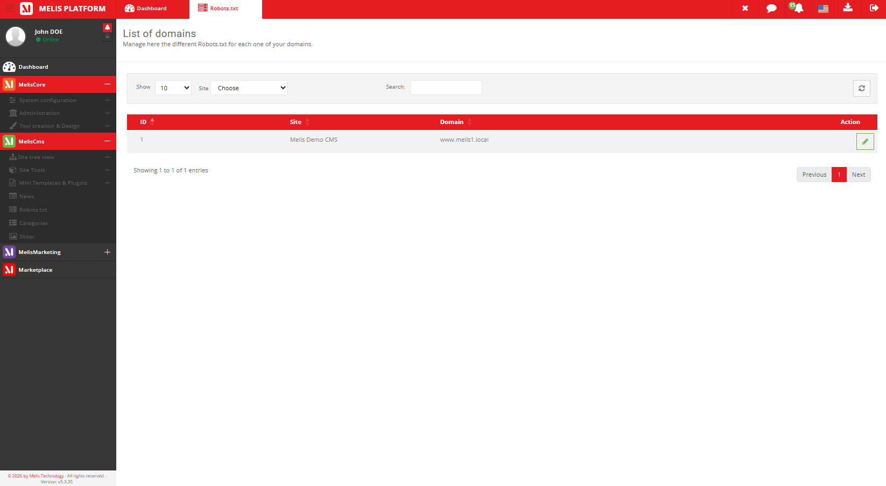
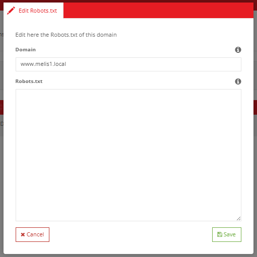

# MelisCmsSiteRobot — Functional & Technical Documentation (for AI)

> **What this is.** MelisCmsSiteRobot lets you **manage the `robots.txt` of each site domain**
> from the back-office and serves it **dynamically** at `https://<domain>/robots.txt` — straight
> from the database, with no static file to maintain.
>
> **Two parts:** **[Part A — Functional Guide](#part-a--functional-guide)** (users) ·
> **[Part B — Technical Reference](#part-b--technical-reference)** (developers/AI, with examples).
> Consumed by the **MelisAI** MCP; the **[Screenshot index](#screenshot-index)** maps filenames.
> Reviewed 2026-06-08.

---
---

# PART A — Functional Guide

## A1. What it lets you do

`robots.txt` is the small file search-engine crawlers read to know which parts of your site they
may index. This tool lets you **edit that file per domain** from the back-office, and it's served
live — so changes take effect immediately, with no developer or file upload needed.

## A2. The Site Robot tool

**Where:** back-office left menu → **CMS** tools → **Site robots** (server icon).

You get a **list of your site domains** (id, site, domain). There's **no "Add"** — the list is
the set of domains your platform already has (**one row per domain**); you only **edit** them.


*The list of site domains — one row per domain; filter and edit.*

Click **Edit** on a domain to open its `robots.txt`: the domain is shown (read-only) and a large
text area holds the **robots.txt content** for that domain. Save it, and it's served live at that
domain's `/robots.txt`.


*The edit modal — write the robots.txt body for the domain.*

## A3. Common tasks — "How do I…?"

- **Block crawlers from a folder** → Site robots → edit the domain → add a `Disallow:` line → save.
- **Point crawlers to your sitemap** → add a `Sitemap: https://<domain>/sitemap.xml` line.
- **Check what's served** → visit `https://<domain>/robots.txt`.

---
---

# PART B — Technical Reference

## B1. Metadata & dependencies

| Item | Value |
|---|---|
| Package | `melisplatform/melis-cms-site-robot` · category `cms` · namespace `MelisCmsSiteRobot\` · dbdeploy |
| Requires | `melis-core`, `melis-cms` (`^5.2`) (uses `melis-engine` table gateways at runtime) |

## B2. Data model

| Table | Role | PK |
|---|---|---|
| `melis_cms_domain_robots` | The robots.txt body for a domain: `robot_site_domain`, `robot_text` | `robot_id` |

The tool lists **site domains** (engine's site-domain table: `sdom_id`, `site_label`,
`sdom_domain`) and links each to its `melis_cms_domain_robots` row.

## B3. Dynamic `/robots.txt` route & data access (with example)

A dedicated front route `/robots.txt` (config `module.config.php`, route
`melis-cms-site-robot-special-urls`) is handled by `ToolSiteRobotController::toolRobotsTxtAction`,
which returns the stored text for the **requesting domain**. The module has no own service; it
reads/writes through **melis-engine** gateways:

```php
// list domains for the tool:
$domains = $sm->get('MelisEngineTableSiteDomain')
              ->getData($search, $cols, $colOrder, $dir, $start, $len)->toArray();

// the robots.txt for a domain (MelisEngineTableRobot maps melis_cms_domain_robots):
$robot = (array) $sm->get('MelisEngineTableRobot')
                    ->getEntryByField('robot_site_domain', $domainName)->current();
echo $robot['robot_text'] ?? '';
```

## B4. The tool

`ToolSiteRobotController` drives everything: `toolContainerAction` (layout),
`getSiteRobotDataAction` (the domains DataTable feed), `toolContentTableActionEditAction` (the
edit button), `toolModalContentAction` (the edit modal, form `site_robot_form` = read-only domain
+ `robot_text` textarea), `saveSiteRobotAction` (upsert into `melis_cms_domain_robots` — the row
is created on first save if absent), `toolSiteRobotContentFiltersSitesAction` (the site filter).
The only row action is **Edit** (no add/delete-row). Menu/tool in `config/app.interface.php` /
`config/app.tools.php`. Listener: `MelisCmsSiteRobotFlashMessengerListener` (back-office).

## B5. Quick code map

```
melis-cms-site-robot/
├── config/   module.config.php (routes incl. /robots.txt) · app.interface.php · app.tools.php
├── src/   Controller/ToolSiteRobotController · Listener/MelisCmsSiteRobotFlashMessengerListener
├── view/ · public/ · language/ · install/ (SQL)
└── etc/   MarketPlace + MelisAI/doc (this doc)
```

---

## Screenshot index

| Image file | Content |
|---|---|
| `meliscmssiterobot-tool-robots-list.png` | Site Robot tool — the list of site domains |
| `meliscmssiterobot-tool-robots-edit.png` | Edit modal — domain + robots.txt textarea |

---

*Document for AI consumption (MelisAI MCP) — `melisplatform/melis-cms-site-robot`. Part A =
functional; Part B = technical with examples. Last reviewed 2026-06-08.*
